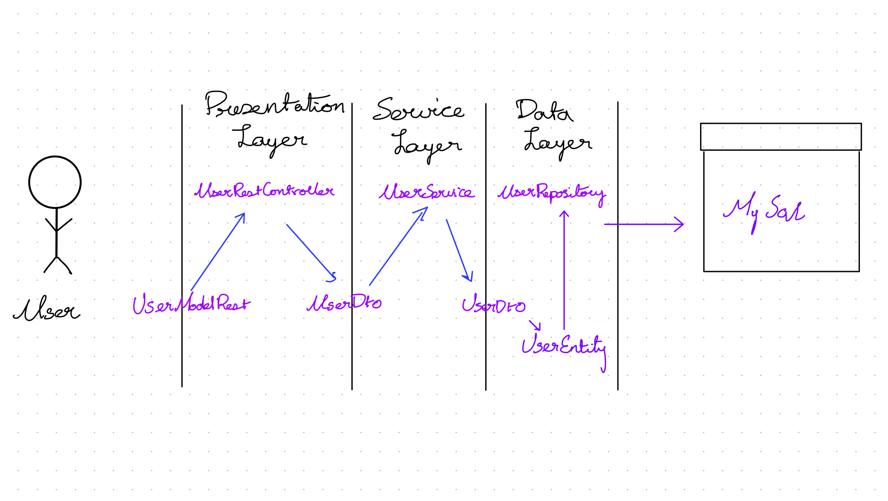

# User-registration-flow
This project focuses on understanding user registration flow using springboot, jpa and mysql. The documentation below is for my own understanding of user registration flow in Springboot. It doesnt conform to any guidelines.

# Annotations used in this project

| @RestController - | This will register the class as rest controller and will receive http requests |
| --- | --- |
| @RequestMapping(&quot;users&quot;) - | Starts with user. [http://localhost:8080/users](http://localhost:8080/users) |
| @GetMapping  - | Added to each functions to bind to get call or post call |
| @PostMapping, @PutMapping, @DeleteMapping - | Each denoting  calls |
| @RequestBody | Read a body from http request and convert that json payload into java object. we have to then create a class that has getters and setters along with an object |
| @Autowired | Used inside the controller. This autowires to  the interface that implements the business logic |
| @Service | Used inside the implementation class to point out to autowire about the function logic. |
| @Id | Java persistence, this id is used to denote unique creation of id |
| @GeneratedValue | Java persistence, specification of generation strategies for the values of primary key |
| @Entity(name = &#39;x&#39;) | Java persistence, where x is the name of the table to store the user records |
| @Column(nullable = false) | Java persistence, the required fields cannot be set to null |
| @Column(nullable = false, length = 50) | Java persistence, the field cannot be null also the filed can hold a maximum of 50 characters |
| @Column(nullable = false, columnDefinition = &quot;boolean default false&quot;) | java persistence, set the default value as false for a boolean property |
| @Repository | This annotation is used when an interface extends crud repository |
| @Column(nullable = false, length = 120, unique=true) | Allows No duplicates in the database table |
| @Component | Indicates that an annotated class is a &quot;component&quot;. Such classes are considered as candidates for auto-detection when using annotation-based configuration and classpath scanning. |
